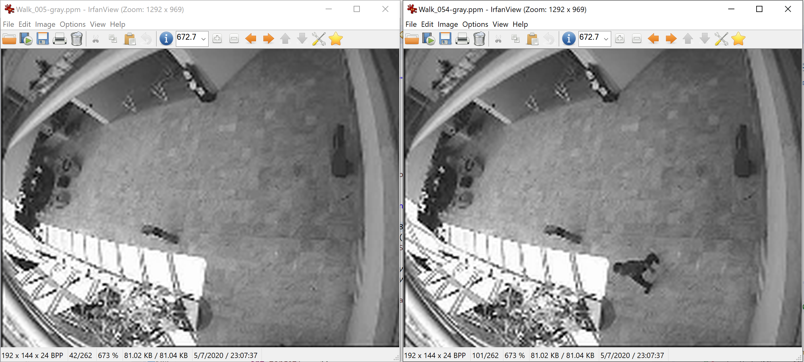

# MotionCompensation 
### From CS4551 Multimedia Software Systems
##### NOTE: Motion compensation is usually done for videos but in this case we are treating every image as 1 frame, this can be abstracted to use any images or to be used on video with some adjustments. 
##### Inside IDB there are 200 images, so assume 200 frames.


``` bash
# Given menu the user shall select what to do

	  		Main Menu
---------------------------------------------
1. Block-Based Motion Compensation 
2. Half-Pixel Block-Based Motion Compensation 
3. Removing Moving Objects
4. Quit
----------------------------------------------

```

###### 1. User shall pass in a target image and a reference image. User shall also pass in a macroblock size (8, 16, 24) and a p-value (2,4,8,12,16). End result will be motion difference between the target and reference image. 

```
Using target frame = 54, reference frame = 5. 
Macroblock = 16, p = 8.



```

###### 2. |NOTE: Not working correctly| Similar to 1) but instead will use Half pixel for better accuracy.

###### 3. User shall pass in target image/frame. End result will be 2 .ppm image files. 1 ppm shall have a red box outline of where there is a difference in motion. The 2nd ppm image file shall remove the object with motion and replace with its closest block selected via recursion.

```
Using target frame = 70, target frame = 5.(Manually selected, frame 1 - 5 there is no motion so it is a good reference). 
If you choose to use different images then be sure to choose one where there is little visual noise.

Macroblock = 16, p = 2.


<Images>

```


``` bash
# How to run: 

Compile
=============================
javac CS4551_Cayetano.java


Run program
==============================
java CS4551_Cayetano

```


# Known Issues
```
  Half-pixel compensation not working properly. 
  I believe its an issue with calculating half pixel average. Will look into it.
```
